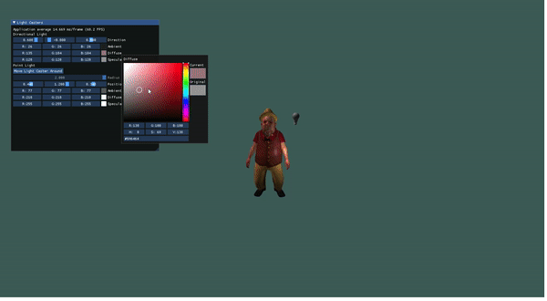
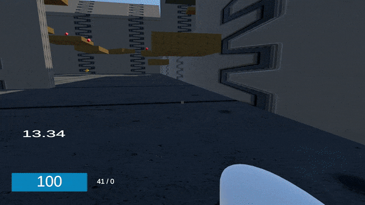

<!-- # Introduction -->

Hi there! I am Aras, a sophomore studying computer engineering in Bogazici University, Turkey. I am interested in game development and programming as well as game engine development. Below you will find my current portfolio.

Contact: <a href = "mailto: arastasci@gmail.com">arastasci@gmail.com</a>

# OpenGL Rendering Engine

You can see the source code [here](https://github.com/arastasci/opengl-render-engine).

## About

In this individual project I made a renderer using C++ and OpenGL. I aimed to understand more about how rendering and animation works and how to abstract them into classes and methods. I have especially learnt a ton of technical information regarding computer graphics.

I made a modular engine that have the basic needs of a proper game engine. One can add entities to the scene or remove them, add light casters to entities or remove them, animate models that have animation files and draw all entities; each with individual method calls. User is also able to fly in the scene as mouse and keyboard inputs are taken.

Using an online tutorial, I made a model loading system using **Assimp** which can import almost any type of 3D model file. I made use of **Phong shading** for rendering 3d objects affected by light casters. With the help of an online tutorial, I have also made a skeletal animation system which takes Collada (.dae) files and animates the object. I also learned to use **ImGui** to make a GUI to easily manipulate variables at runtime.

My main takeaway from this project was understanding the design of a game engine and how various components communicate with each other.
Experimenting with different design choices and seeing how they make the programmer's day easier in some places but harder in others gave me a deeper understanding of game engines and in general, software design.

The current result is below:

Here is a link to a full walkthrough of the project: [YouTube link](https://youtu.be/_5bF9Hu2eBs)

# Multiplayer Shooter Game

You can see the source code [here](https://github.com/arastasci/multiplayer-shooter).

## About

In this project I made a multiplayer FPS game with Unity. The game is a fast-paced free-for-all deathmatch in which players have two guns: a pistol and a rocket launcher. Players can propel themselves with the rockets they launch and it is a vital part of the gameplay; players must be swift in order not to explode or get shot so this movement style is essential. You can also climb certain walls and wall jump. I was always fond of multiplayer games and I am a fan of fast-paced multiplayer shooters like Quake so this game pays homage to them.

## Project Overview

### Gameplay Programming

The movement is heavily physics based. The players have rigidbody components and forces are applied to them according to inputs and external factors (such as rocket explosions and speed boosts). The player can climb and jump off walls, crouch and slide and rocket-jump. I made a custom map suitable for this type of movement, with platforms and strategically placed walls that can be wall-jumped. I created a scoreboard in which each client can see each others' info (like username, kill, death, ping) ranked by the kill count. I also created a kill log at the top-right corner of the screen from which you can see the latest kills and its content (killer, victim, gun used). I also made a player tag which is only visible when the player is in your sight, which makes sense as this is a free-for-all. I put spawn areas in various locations and made spawners which spawn power-ups which can heal or speed up the player who picked it.

### Netcode

Obviously, implementing the networking solution was tricky. I took use of an online tutorial on socket programming for multiplayer games, and I used .NET Sockets. Although I didn't write a completely original solution as I followed a tutorial I thoroughly understood the concepts and experienced the cumbersome process of creating a netcode. Below is my explanation of the code.

Using classes I created named Packet (which is a class for creating, reading and writing on packet instances), Client (which contains the client endpoint and methods to receive and) and Server (which represents the server endpoint), I abstracted communicating between client and server to simply creating `PacketHandler` and `SendData` methods.
After a to-be client sends a connection request to the server via both TCP and UDP from the `Client` class and `Server` receives a callback for that, if there is space the client is placed on one of the spots in the `Server.clients` hashmap(which is a `Dictionary<int,Client>`) and its endpoint info is transferred to there. After this process, the receiving and sending of packets are handled from that `Client` instance. As the endpoints have the ability to send and receive data through TCP and UDP, I used TCP for reliable communication and UDP for fast but unreliable communication.

The reason I went with creating a custom networking solution instead of an already available one was my desire to get a deeper understanding of how multiplayer game netcodes are made.

I made two Unity projects: one for the server and one for the client. The reason for this is I wanted to make the game server-authoritative as it is a good practice for competitive games because it makes it significantly harder to cheat. Lastly, I made a Linux server build for the server and was able to host a game in the cloud using AWS.
